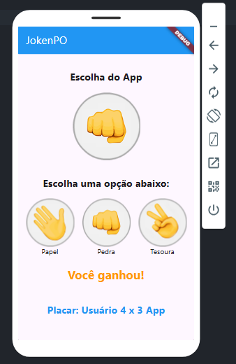
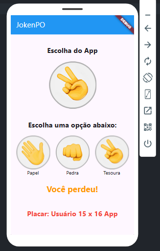
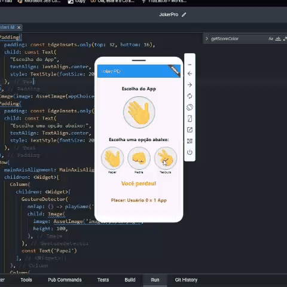

# Jogo Jokenpo em Flutter

## Descrição
Este é um jogo de Jokenpo (Pedra, Papel e Tesoura) desenvolvido em Flutter, onde o jogador compete contra o aplicativo. O jogo é simples, intuitivo e visualmente agradável, ideal para passar o tempo e testar sua sorte e estratégia contra a máquina.

## Funcionalidades
- **Jogo Contra o Aplicativo:** Jogue pedra, papel ou tesoura contra o computador e veja quem vence cada rodada.
- **Placar Integrado:** Acompanhe sua pontuação em tempo real. O placar mostra quantas partidas você ganhou, perdeu ou empatou.
- **Interface Amigável:** Interface limpa e responsiva, projetada para proporcionar uma experiência de usuário fluida e agradável.

## Tecnologias Utilizadas
- **Flutter:** O projeto foi desenvolvido utilizando o framework Flutter, ideal para a criação de aplicativos bonitos e compilados nativamente.
- **Dart:** A lógica do jogo foi implementada em Dart, que é a linguagem usada pelo Flutter.

## Como Jogar
1. **Escolha Sua Jogada:** Escolha entre Pedra, Papel ou Tesoura.
2. **Veja o Resultado:** O aplicativo também fará sua escolha aleatoriamente. A rodada será resolvida e o placar atualizado de acordo com as regras do Jokenpo.

## Instalação
Para rodar o jogo localmente, siga estas etapas:
1. Clone o repositório para sua máquina local.
2. Abra o diretório do projeto em um terminal.
3. Execute `flutter pub get` para instalar as dependências.
4. Execute `flutter run` para iniciar o jogo em um dispositivo conectado ou emulador.

Você pode ver melhor pelas imagens abaixo:

